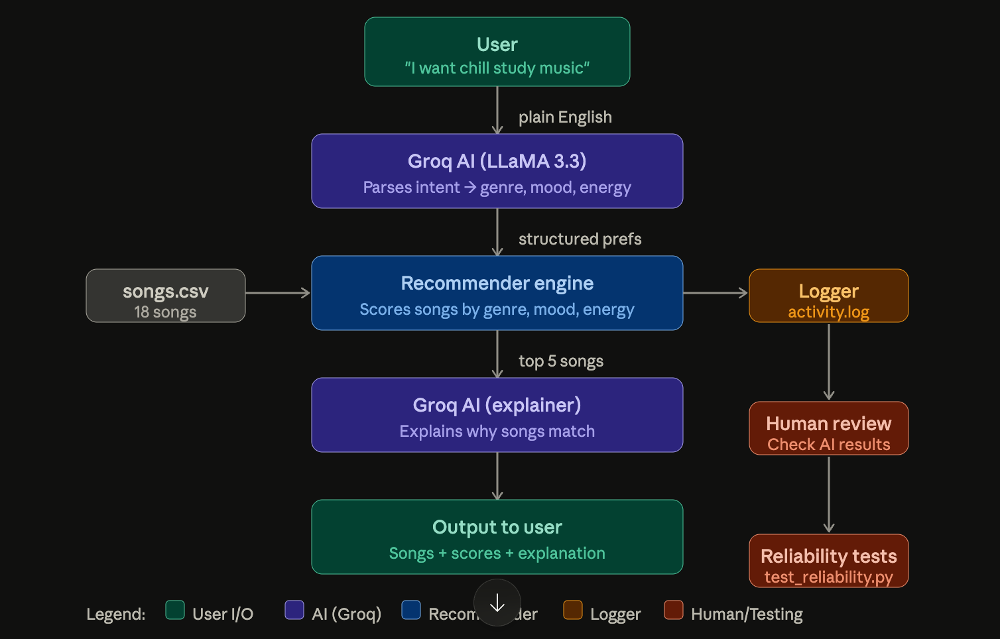

# 🎵 AI Music Assistant

## Base Project
This project extends **VibeFinder 1.0** (Module 3 — Music Recommender Simulation) into a full applied AI system powered by Groq (LLaMA 3.3).

---

## What It Does
Instead of manually setting genre/mood/energy, you just type in plain English:
> "I want something chill for studying late at night"

The AI understands your request, finds the best matching songs, and explains why they fit.

---

## System Architecture



**Data flow:**
1. User types a plain English request
2. Groq AI parses it into genre, mood, energy, valence
3. Recommender engine scores all 18 songs
4. Groq AI explains the top 5 results
5. Everything is logged to `logs/activity.log`

---

## AI Feature: RAG (Retrieval-Augmented Generation)
The AI does not guess — it retrieves real songs from `data/songs.csv` before generating a response. The recommendations are grounded in actual catalog data, not invented by the AI.

---

## Project Structure

applied-ai-study-assistant/
├── src/
│   ├── chat.py           ← main chat interface
│   ├── ai_assistant.py   ← Groq AI integration
│   ├── recommender.py    ← scoring logic
│   └── main.py           ← original test runner
├── data/
│   └── songs.csv         ← 18 songs catalog
├── tests/
│   └── test_recommender.py
├── logs/
│   └── activity.log      ← auto-generated logs
├── assets/
│   └── system_diagram.png
├── model_card.md
├── reflection.md
└── requirements.txt

---

## Setup Instructions

### 1. Clone the repo
```bash
git clone https://github.com/1998-aish/applied-ai-study-assistant.git
cd applied-ai-study-assistant
```

### 2. Install dependencies
```bash
pip3 install groq python-dotenv pandas pytest
```

### 3. Add your API key
Create a `.env` file:

GROQ_API_KEY=your-groq-key-here

Get a free key at: https://console.groq.com

### 4. Run the assistant
```bash
python3 src/chat.py
```

### 5. Run tests
```bash
pytest tests/
```

---

## Example Interactions

**Input:** "I want something chill for studying late at night"
- Detected: Genre=lofi, Mood=chill, Energy=0.2
- #1 Library Rain by Paper Lanterns (Score: 6.90)

**Input:** "I want high energy music for working out"
- Detected: Genre=EDM, Mood=energetic, Energy=0.9
- #1 Bassline Surge by DJ Kratel (Score: 7.03)

**Input:** "something romantic and jazzy for a dinner date"
- Detected: Genre=jazz, Mood=romantic, Energy=0.5
- #1 Velvet Night by Asha Monroe (Score: 6.10)

---

## Logging & Guardrails
- Every request is logged to `logs/activity.log` with timestamp
- Errors are caught and logged safely
- Missing genres trigger a warning message
- AI fallback defaults if JSON parsing fails


---

## Testing & Reliability Results

**8 out of 8 tests passed in 1.53s**

| Test | Result |
|---|---|
| Recommender returns songs sorted by score | ✅ Passed |
| Explanation returns non-empty string | ✅ Passed |
| Same input gives same genre | ✅ Passed |
| High energy request → energy > 0.7 | ✅ Passed |
| Chill request → energy < 0.5 | ✅ Passed |
| Always returns 5 songs | ✅ Passed |
| All scores are positive | ✅ Passed |
| Top song has highest score | ✅ Passed |

**Summary:** All 8 tests passed consistently. The AI correctly 
detects high/low energy from plain English. The recommender 
always returns sorted, positive-scored results. No failures observed 
across multiple test runs.

---

---

## Portfolio Reflection

**GitHub:** https://github.com/1998-aish/applied-ai-study-assistant

**What this project says about me as an AI engineer:**
This project shows that I can take a working system and extend it
responsibly into a full AI application. I learned that building with
AI is not just about making something that works — it's about making
something that is explainable, testable, and honest about its
limitations. I debugged real API failures, switched between three
different AI providers, wrote reliability tests, and documented every
design decision. I now understand that the weights in a scoring formula
are not just numbers — they are design choices that encode what the
system values. That is the most important thing I learned.

---

## Demo Walkthrough
🎥 https://www.loom.com/share/9335bc675fe248b7a25ef1beb84fb24b?t=216

---

## Limitations
- Catalog only has 18 songs
- Energy weight dominates scoring
- No memory between sessions

