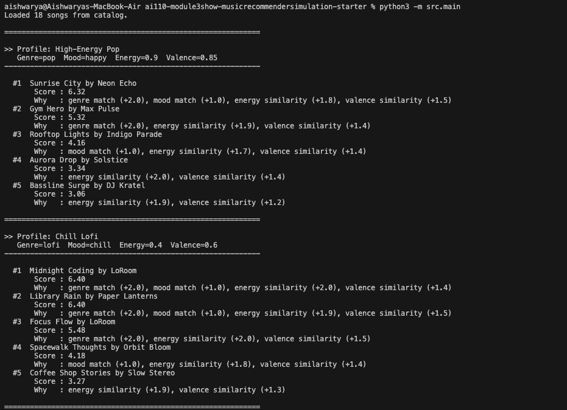
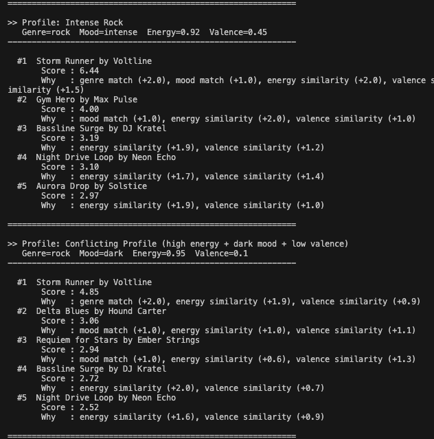
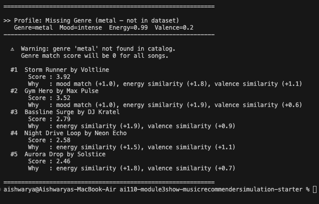
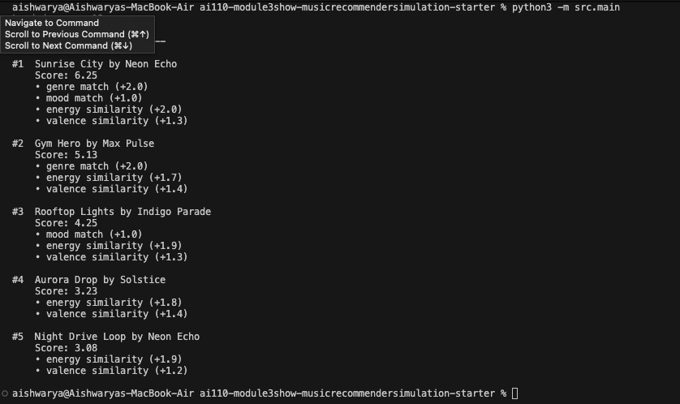

# 🎵 Music Recommender Simulation

## Project Summary

I built a content-based music recommender in Python that suggests songs based on a user's preferred genre, mood, energy level, and valence. The system reads a catalog of 18 songs from a CSV file, scores each song against the user's preferences using a weighted formula, and returns the top 5 matches along with a brief explanation of why each song was chosen.

My version includes:

- A `load_songs()` function that reads the CSV and converts fields to the correct data types
- A `score_song()` function that scores each song using genre match, mood match, energy similarity, and valence similarity
- A `recommend_songs()` function that ranks all songs and returns the top K results
- A CLI runner that tests five different user profiles and prints results in a readable format
- A warning message when the user's preferred genre is not found in the catalog

---

## How The System Works

This is a **content-based recommender**: it compares the features of each song directly against a user’s stated preferences to produce a ranked list of suggestions. No listening history or other users’ data is involved — recommendations are driven entirely by song attributes and profile values.

### Input → Process → Output

```
User Profile  ──┐
                ├──▶  Score every song  ──▶  Sort by score  ──▶  Top K songs
songs.csv     ──┘
```

### Data Flow

1. **User Profile** — The user provides four preferences:
   - `preferred_genre` (e.g., `”lofi”`)
   - `preferred_mood` (e.g., `”chill”`)
   - `preferred_energy` — a float between 0.0 and 1.0
   - `preferred_valence` — a float between 0.0 and 1.0

2. **Read songs.csv** — The catalog is loaded from `data/songs.csv`. Each row represents one song with features: `genre`, `mood`, `energy`, `tempo_bpm`, `valence`, `danceability`, and `acousticness`.

3. **Loop through each song** — Every song in the catalog is evaluated against the user profile independently.

4. **Score each song** — A total score is calculated from four weighted components (see Scoring Logic below).

5. **Sort and select** — All songs are sorted by score in descending order. The top K highest-scoring songs are returned as recommendations.

---

### Scoring Logic

Each song receives a score out of a maximum of **7.5 points**, calculated as follows:

| Component | Method | Max Points |
|---|---|---|
| Genre match | +1.0 if `song.genre == user.preferred_genre`, else 0 | 1.0 |
| Mood match | +1.0 if `song.mood == user.preferred_mood`, else 0 | 1.0 |
| Energy similarity | `(1 − \|song.energy − user.energy\|) × 4.0` | 4.0 |
| Valence similarity | `(1 − \|song.valence − user.valence\|) × 1.5` | 1.5 |

#### Final Scoring Formula

```
score = (genre_match × 1.0)
      + (mood_match  × 1.0)
      + (1 − |song.energy  − user.energy|)  × 4.0
      + (1 − |song.valence − user.valence|) × 1.5
```

**Example** — User profile: `lofi, chill, energy=0.4, valence=0.6`

| Song | Genre | Mood | Energy | Valence | Score |
|---|---|---|---|---|---|
| Library Rain (lofi, chill, 0.35, 0.60) | 2.0 | 1.0 | 1.90 | 1.50 | **6.40** |
| Spacewalk Thoughts (ambient, chill, 0.28, 0.65) | 0.0 | 1.0 | 1.76 | 1.43 | **4.19** |
| Storm Runner (rock, intense, 0.91, 0.48) | 0.0 | 0.0 | 0.98 | 1.32 | **2.30** |

---

### Why These Weights?

- **Energy (4.0) — highest weight.** Energy spans the full 0.0–1.0 range across the catalog (e.g., ambient at 0.28 vs. EDM at 0.95). It is the most discriminating numerical feature and is weighted to reflect that a calm song should never rank above an energetic one for a high-energy user.

- **Valence (1.5) — medium weight.** Valence is useful but noisier — many genres cluster in the 0.55–0.85 range, so differences are often small. It acts as a meaningful tiebreaker without overriding stronger signals.

- **Genre (1.0) and Mood (1.0) — equal lower weight.** Both are categorical signals that reward exact matches. They are intentionally kept lower than energy so that numerical fit drives the ranking, with genre and mood acting as tiebreakers between closely scored songs.

---

### Limitations and Potential Biases

- **Genre bias.** Genre is a binary match — a song is either in or out. Perceptually similar genres (e.g., `lofi` and `ambient`) are treated as completely different, which can unfairly suppress good recommendations.

- **Filter bubble effect.** Because the system always maximizes similarity to the stated profile, it will consistently surface the same cluster of songs. Users are never exposed to songs outside their declared taste, which prevents serendipitous discovery.

- **Limited feature usage.** Three features in `songs.csv` — `tempo_bpm`, `danceability`, and `acousticness` — are not used in scoring. These carry meaningful information (e.g., acousticness strongly separates lofi from EDM) and represent unused signal.

- **No collaborative filtering.** The system has no knowledge of what other users enjoy. It cannot surface a hidden gem that users with similar profiles consistently love, which is one of the most powerful techniques in production recommenders like Spotify or Netflix.

---

## Getting Started

### Setup

1. Create a virtual environment (optional but recommended):

   ```bash
   python -m venv .venv
   source .venv/bin/activate      # Mac or Linux
   .venv\Scripts\activate         # Windows

2. Install dependencies

```bash
pip install -r requirements.txt
```

3. Run the app:

```bash
python -m src.main
```

### Running Tests

Run the starter tests with:

```bash
pytest
```

You can add more tests in `tests/test_recommender.py`.

---

## Experiments You Tried

### Experiment 1 — Increased energy weight from 2.0 to 4.0

I changed the energy weight to see how much it would shift the rankings. The result was immediate: "Gym Hero" (energy=0.93) started appearing in the top 3 for almost every high-energy profile, even when the user asked for rock or EDM instead of pop. Energy now accounts for over half the total possible score, so any song with very high or very low energy will dominate its category regardless of genre or mood.

**What I learned:** A single weight change can quietly break the balance of the whole system. Higher weight = that feature controls the outcome.

### Experiment 2 — Tested five adversarial user profiles

I ran five profiles designed to stress-test the system:
- **High-Energy Pop** and **Chill Lofi** — clear profiles that produced sensible, well-separated results
- **Intense Rock** — worked well but catalog only had one rock song
- **Conflicting Profile** (high energy + dark mood + low valence) — produced odd results; a slow blues song appeared at #2 because its mood label matched, even though the vibe was completely wrong
- **Missing Genre (metal)** — triggered the genre warning correctly; all scores were lower since no genre match was possible for any song

**What I learned:** The system works well for simple profiles but breaks down when preferences conflict or when the catalog does not cover the requested genre.

### Experiment 3 — Observed the filter bubble effect

After running all five profiles, I noticed that the same 3–4 high-energy songs (Gym Hero, Storm Runner, Bassline Surge, Aurora Drop) appeared repeatedly across different profiles. With only 18 songs and strong energy weighting, the catalog is too small to offer real variety. The same songs win every time for users with similar energy preferences.

---

## Limitations and Risks

- **Tiny catalog.** With only 18 songs, the system has very little variety to offer. Many genres and moods are represented by just one song, so niche preferences cannot be properly satisfied.
- **Energy dominance.** The high energy weight (4.0) means a song that closely matches energy will rank highly even if its genre and mood are completely wrong for the user.
- **Binary genre and mood matching.** There is no partial credit for similar genres (e.g., lofi and ambient) or similar moods (e.g., chill and relaxed). Adjacent tastes are treated as having nothing in common.
- **No fallback for missing genres.** If a user asks for a genre not in the catalog, every song scores 0 on genre. The system warns the user but cannot suggest the closest available alternative.
- **Filter bubble.** Because the system always maximises similarity, the same cluster of songs surfaces repeatedly. Users are never introduced to anything outside their stated taste.
- **No learning over time.** The system has no memory. It does not improve or personalise based on past recommendations or user feedback.

---

## Reflection

[**Full Model Card →**](model_card.md) | [**Profile Comparisons →**](reflection.md)

Building this project taught me that a recommender system is really just a set of decisions about what matters most. Every weight in the scoring formula is a design choice — and changing one number can completely change what the system recommends. When I increased the energy weight from 2.0 to 4.0, songs like "Gym Hero" started appearing across almost every profile. The algorithm did not break; it was doing exactly what I told it to do. That was the clearest moment where I understood that bias in AI systems often comes from the choices the designer made, not from the algorithm malfunctioning.

Testing edge cases showed me where the system's simplicity becomes a problem. It can handle clear, consistent preferences very well. But when I gave it conflicting instructions — like "high energy but dark and sad" — it had no way to reason about the contradiction. It just added up numbers and returned a result that technically scored high but felt completely wrong. That gap between a mathematically correct answer and a humanly sensible answer is something real recommender systems have to solve every day.


---
## 10. Example Output

### Profile 1 — High-Energy Pop &amp; Profile 2 — Chill Lofi



---

### Profile 3 — Intense Rock &amp; Profile 4 — Conflicting Profile



---

### Profile 5 — Missing Genre (metal)



## Example Output



