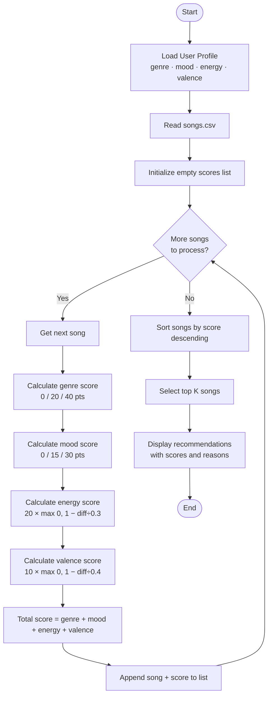

```mermaid
flowchart TD
    A([Start]) --> B[Load User Profile\ngenre · mood · energy · valence]
    B --> C[Read songs.csv]
    C --> D[Initialize empty scores list]
    D --> E{More songs\nto process?}

    E -- Yes --> F[Get next song]
    F --> G[Calculate genre score\n0 / 20 / 40 pts]
    G --> H[Calculate mood score\n0 / 15 / 30 pts]
    H --> I[Calculate energy score\n20 × max 0, 1 − diff÷0.3]
    I --> J[Calculate valence score\n10 × max 0, 1 − diff÷0.4]
    J --> K[Total score = genre + mood + energy + valence]
    K --> L[Append song + score to list]
    L --> E

    E -- No --> M[Sort songs by score descending]
    M --> N[Select top K songs]
    N --> O[Display recommendations\nwith scores and reasons]
    O --> P([End])
```
